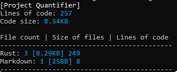

# Project Quantifier

This project is a small tool to see the size of your project.

Usage: project_quantifier [file formats you want to look(no binary files like .exe)].

Example:
```
quantifier .rs .md
```
->



# Modules

There are currently two modules in this program, [rust functions and structs counter](src/modules/rust_fn_counter.rs) and also [rust dependency counter](src/modules/rust_dep_counter.rs).

You can create your own module to this program by creating a file in [src/modules](src/modules) and your own struct with the name of your module. You'll have to import [shared.rs](src/shared.rs) to implement the trait Run for your module. Then your module will have to be listed in [modules.rs::run_modules()](src/modules.rs). Don't forget to make your struct public!